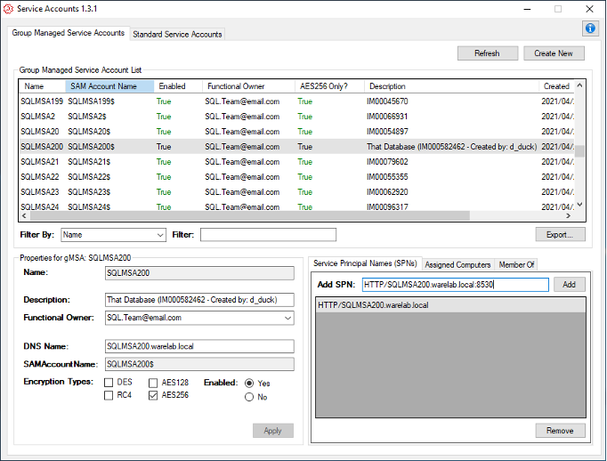
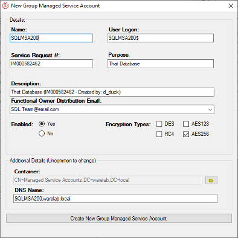

# Service Account Management Tool

Welcome to the Service Account Management Tool! This is a PowerShell script that simplifies the process of managing service accounts in an Active Directory environment. With this tool, you can create, modify, and remove Group Managed Service Accounts (gMSA) and Standard Service Accounts with ease.

## Features

Here are some of the key features of the Service Account Management Tool:

- Create new Group Managed Service Accounts (gMSA)
- Remove existing gMSA
- Assign and remove Service Principal Names (SPNs) to gMSA
- Add and remove gMSA from Active Directory groups
- Modify gMSA attributes
- Create new Standard Service Accounts
- Remove existing Standard Service Accounts
- Add and remove Standard Service Accounts from Active Directory groups
- Modify Standard Service Account attributes
- Migrate Standard Service Accounts to gMSA

## Screenshots





## Getting Started

### Prerequisites

To run the Service Account Management Tool, you will need:

- Windows PowerShell 5.1 or later
- The ActiveDirectory module installed on your system
- The appropriate permissions to create and manage service accounts in Active Directory

### Installation

To use the Service Account Management Tool:

Download the script from the GitHub repository.
Open PowerShell as Administrator.
Navigate to the folder where the script is located.
Run the following command:

```powershell
.\ServiceAccounts.ps1
```

The GUI will launch, and you can begin using the tool to manage service accounts.

## Usage

Additional usage details are available in the [User Guide](UserGuide.docx)

## License

The Service Account Management Tool is licensed under the MIT License. See the LICENSE file for more information.